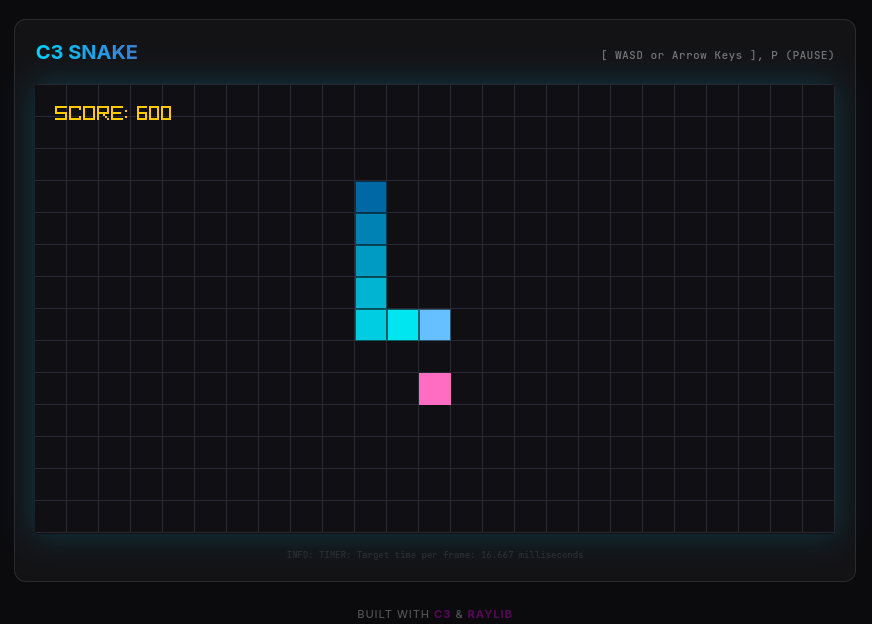

# C3 Snake

Snake game written in [C3](https://c3-lang.org) using [Raylib](https://www.raylib.com/).

<p align="center">
  <a href="https://manulinares.github.io/c3-snake/">
	
	<br>
	<b>🚀 Click here to play in the browser! 🚀</b>
  </a>
</p>

## Build and Run

```sh
c3c run snake
```

### Web (WASM)
```sh
# Requires emscripten (emcc)
c3c build web --trust=full
# Output is in build/index.html
```

## Controls

| Key | Action |
|-----|--------|
| WASD / Arrows | Movement |
| P | Pause / Resume |
